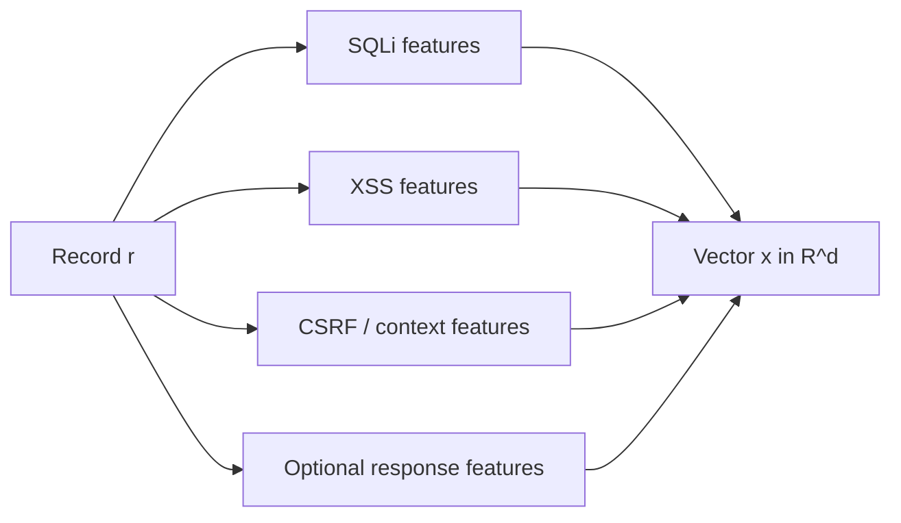
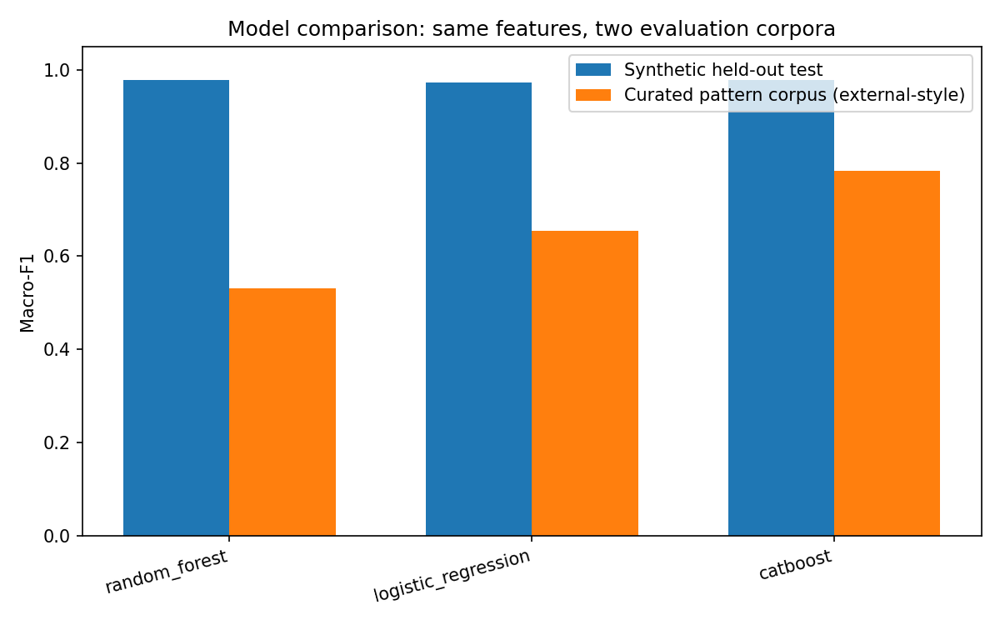
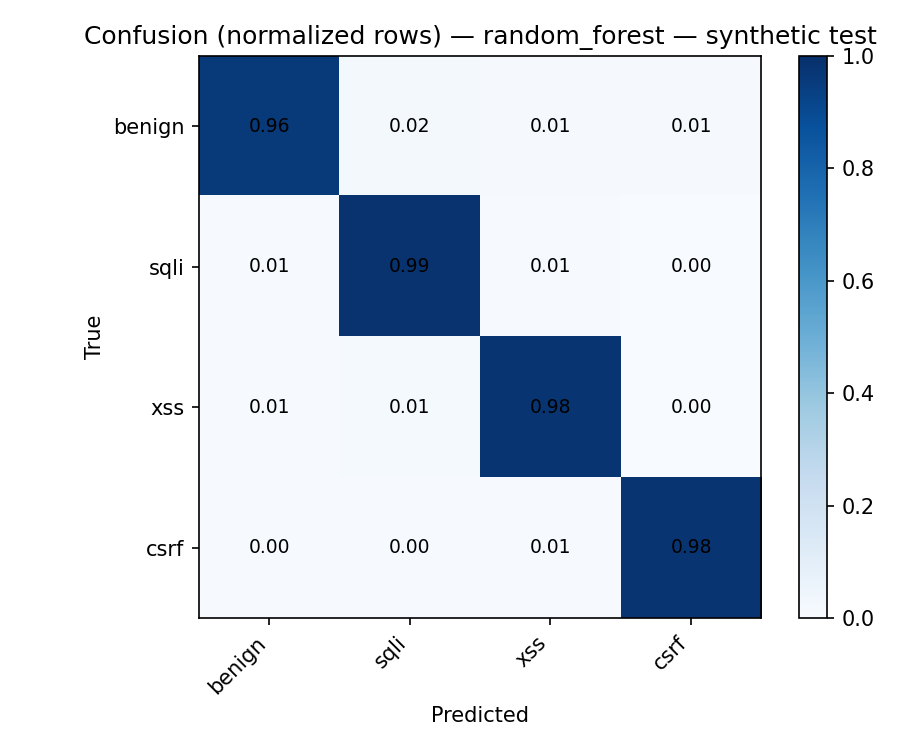
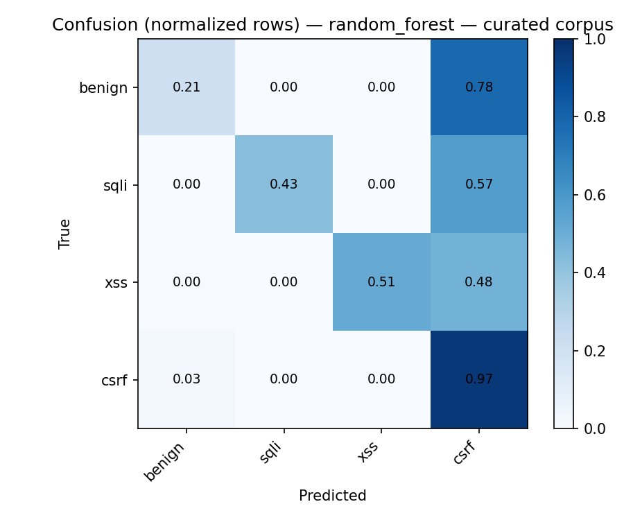

# Multiclass Supervised Learning for Web Application Attack Families: A Tabular Feature and Ensemble-Tree Methodology

**Article type:** Original research (methodology and experimental framework)

**Authors:** [Author Name(s)]  
**Affiliation:** [Institution]  
**Correspondence:** [email]  
**Date:** March 2026  

**Suggested citation:** [Authors]. *Multiclass Supervised Learning for Web Application Attack Families: A Tabular Feature and Ensemble-Tree Methodology.* [Venue], 2026.

---

## Abstract

Injection flaws, cross-site scripting (XSS), and cross-site request forgery (CSRF) remain central entries in industry vulnerability taxonomies [1], [2]. Much of the machine-learning literature on HTTP-layer detection collapses attack types into a single *malicious* class, which obscures per-family error patterns and complicates alignment with security operations metrics [3], [4]. This paper describes a **research-oriented pipeline** for **multiclass** classification of web-bound payloads and request metadata into benign, SQL injection (SQLi), XSS, and CSRF, using **hand-crafted tabular features** and **ensemble tree learners** (random forest, gradient-boosted decision trees, and related linear baselines) [5]–[7]. We formalize stratified evaluation under class imbalance [8], [9], **calibration-aware** scoring via expected calibration error (ECE) and Brier score [10]–[12], **bootstrap** uncertainty for macro-averaged F1 [13], **semantic feature ablation** by attack family, and a **lightweight evasion transform battery** to probe sensitivity to encoding and lexical perturbations [14], [15]. **Empirically**, we report results on (i) a **procedural synthetic corpus** with controlled priors and label noise and (ii) a **curated pattern corpus** of textbook SQLi/XSS/CSRF/benign strings wrapped in the same HTTP simulation—highlighting **cross-corpus generalization** and **dataset shift** [46]. We **compare** random forest, multinomial logistic regression, and CatBoost under identical splits and features [31], [33]. The contribution is **methodological, empirical, and reproducible** (`scripts/paper_experiments.py` regenerates tables and figures).

**Keywords:** web application security; SQL injection; XSS; CSRF; multiclass classification; tabular features; gradient boosting; random forest; class imbalance; calibration; robustness evaluation; reproducible research

---

## 1. Introduction

Web applications continue to be abused through injection, content-injection, and session-riding patterns documented in standard references and threat enumerations [1], [2], [16]. Defensive practice combines secure design, runtime monitoring, and, increasingly, statistical detectors trained on labeled traffic or payloads. Supervised learning can support triage when **labels and features are consistent with deployment**; however, **train–serve skew**, **prior shift**, and **adversarial obfuscation** remain primary failure modes in security-relevant ML [17], [18].

**Binary versus multiclass.** Binary models (benign vs. attack) maximize headline accuracy but often hide **which** attack family is confused with benign or with another family—information that matters for playbooks, patches, and metrics aligned with OWASP-style categories [1], [3]. Multiclass formulations that distinguish SQLi, XSS, and CSRF better match analyst workflows at the cost of harder optimization when class frequencies differ sharply [8], [9].

**Contributions.** (1) A **multiclass** setup (four classes) with **macro-F1** emphasis under imbalance. (2) A **structured feature catalog** (lexical, structural, request-context, optional response-side) for tabular learning. (3) **Algorithms** for corpus construction, feature extraction, training, and research evaluation (calibration, bootstrap, ablation, evasion stress tests). (4) Discussion of **limitations** and a **reference set** spanning web security, ensemble methods, calibration, imbalance learning, and adversarial ML.

---

## 2. Related Work

**Attack families.** SQLi manipulates query structure and interpreter semantics [19]. XSS injects content interpreted in HTML or script contexts [20]. CSRF abuses authenticated sessions when cross-site requests are insufficiently bound to user intent [21], [22].

**ML for intrusion and web-layer detection.** Surveys summarize misuse detection, anomaly detection, and supervised learning on flows, logs, and payloads [23], [24]. Tree ensembles and boosting remain strong defaults on heterogeneous tabular features with mixed scales and sparsity [5]–[7], [25].

**Operational ML.** Training–serving inconsistency and undeclared consumers of features compound technical debt in production ML systems [17]; in security, mismatches between lab features and edge deployment can silently degrade detection [18].

**Robustness.** Evasion attacks and adversarial perturbations are well studied for classifiers in security domains [14], [15], [26]. Lightweight transform batteries do not replace formal threat models but document **brittleness** to common obfuscations.

**Gap.** We target an explicit **four-class** tabular pipeline with imbalance-aware metrics, calibration summaries, bootstrap intervals, semantic ablation, and reproducible experiment configuration—rather than reporting a single accuracy figure on an unspecified binary task.

---

## 3. Problem formulation

Each sample is a record with a **payload** string plus HTTP-related metadata (method, URL length, cookie/token flags, optional simulated response fields). Feature extraction maps each record to a fixed-length numeric vector of dimension \(d\). The **target** is one of four classes: **benign**, **sqli**, **xss**, **csrf**. Models are trained with standard **multiclass supervised learning** (e.g., tree ensembles or logistic regression) to predict the class from the feature vector.

**Evaluation.** We report accuracy, **macro-F1** and weighted F1, per-class precision/recall/F1, and the confusion matrix [8], [9], [27]. When class priors are skewed, **macro-F1** is treated as the primary summary. Where models output probabilities, we also report **expected calibration error (ECE)** and the **multiclass Brier score** [11], [12], [28], and use the gap between the top two class probabilities as a simple **confidence margin** for triage (low margin → manual review) [10], [11].

---

## 4. Dataset construction (controlled synthetic corpus)

To study the learning problem under known priors, a **synthetic generator** samples payloads per class (SQLi, XSS, CSRF, benign templates), assigns labels, and **simulates** HTTP request–response fields (method biased toward POST for CSRF-heavy scenarios, status codes, timing, flags for cookies, CSRF tokens, referer) so that **contextual and response-side features** are populated consistently. Optional **label noise** perturbs a fraction of labels to probe robustness. Total scale, class mixture, seed, and noise rate are configuration parameters for reproducibility [17], [29].

**Algorithm 1 — Synthetic record generation (conceptual)**  
**Input:** Label \(y \in \{\mathrm{benign},\mathrm{sqli},\mathrm{xss},\mathrm{csrf}\}\); random seed \(\sigma\).  
**Output:** Record \(r\) with `payload`, `label`, and metadata fields.

1. Draw payload template according to \(y\) from family-specific libraries.  
2. Simulate `request_method`, `url`, `cookies_present`, `token_present`, `referrer_present`, and response fields (`response_status`, `response_length`, …) conditioned on \(y\) and \(\sigma\).  
3. Emit \(r\) as a row in columnar storage (CSV/Parquet).

### 4.1 Procedural synthetic corpus (in-distribution)

For controlled experiments we use the built-in generator (\(N=20{,}000\) rows unless stated otherwise): **80%** attack / **20%** benign, attack families mixed in thirds, **2% label noise**, random **seed 42**, and the same HTTP simulation as in Algorithm 1. Features are extracted in **payload-only** mode (\(d=45\) numeric columns in the reported build).

### 4.2 Curated pattern corpus (“real” attack strings, external-style evaluation)

To complement the procedural generator, we assemble a **second corpus** that does not use the same template-sampling code path: **static, publicly familiar** SQLi tautologies and union/stacked patterns, XSS vectors and encodings, CSRF-flavored POST bodies, and benign HTTP-like parameter strings (education and OWASP-style references [1], [16], [20]–[22]). Each row is passed through the **identical** `simulate_http_record` wrapper so metadata fields remain comparable. We draw **400 samples per class with replacement** (\(N=1{,}600\), shuffle seed **7**). This corpus is **not** a capture of production traffic; it stress-tests whether models trained only on the procedural generator **transfer** to independently authored payload strings—a form of **covariate shift** [46].

### 4.3 Evaluation protocol for cross-corpus comparison

We apply a **stratified 70% / 15% / 15%** train/validation/test split on **synthetic featured data only** (seed 42). **No curated rows appear in training.** All models are scored on (a) the **synthetic test** split (in-distribution) and (b) the **full curated set** (out-of-distribution relative to the generator). Metrics: accuracy, **macro-F1**, weighted F1, multiclass ROC-AUC (one-vs-rest), **ECE**, and **Brier score** [11], [12], [27].

---

## 5. Feature engineering

### 5.1 Feature groups

Features are **binary indicators, counts, ratios, and simple statistics** derived from the payload and metadata:

- **SQLi-oriented:** keyword and tautology-style indicators, quote/comment counts, entropy, length, density measures [19], [30].  
- **XSS-oriented:** script tags, `javascript:` URLs, event handlers, encoding cues [20].  
- **CSRF-oriented:** token/referer/cookie proxies, state-changing method flags [21], [22].  
- **Contextual:** payload/URL length, digit and special-character ratios, whitespace and percent-encoding ratios, method indicators.

### 5.2 Modes (train–serve consistency)

**Payload-only** uses request-side and payload-derived columns only. **Response-only** uses simulated response attributes. **Hybrid** concatenates both. An extended **SQLi-focused** mode retains a larger SQL keyword set while still combining XSS/CSRF/common signals for multiclass studies. **Inference must use the same mode as training** [17].

**Figure 1.** Feature assembly (conceptual).

---

## 6. Learning algorithms and implementation scope

### 6.1 Preprocessing

Numeric columns are selected; non-numeric identifiers and raw strings (e.g., full URL, raw headers) are excluded from the matrix. Labels are mapped to integers. A **stratified** split yields train, validation, and test partitions with fixed random seed [29].

### 6.2 Models

The implementation supports **random forest** [5], **histogram-based gradient boosting** (XGBoost, LightGBM) [6], [7], **CatBoost** [31], **logistic regression**, and **RBF-kernel SVM** with probability estimates as complementary baselines. Hyperparameters (e.g., number of trees, depth) are user-configurable; class imbalance may be addressed via **class weights** in applicable learners [8].

**Algorithm 2 — Training and evaluation (high level)**  
**Input:** Labeled feature table \(\mathcal{D}\); algorithm \(A\); split ratios; seed \(\sigma\).  
**Output:** Trained \(f_\theta\); metrics on train/val/test.

1. Load \(\mathcal{D}\); build \(X, y\); stratified split.  
2. Instantiate \(A\); fit on training data.  
3. For each split, compute accuracy, macro-F1, weighted F1, confusion matrix, and multiclass ROC-AUC (one-vs-rest) where defined.  
4. Persist model and preprocessor metadata (feature column order, label map, feature mode, algorithm).

### 6.3 Research evaluation hooks

For the **test** split, optional **extended research metrics** include: multiclass **ECE** and **Brier score** [11], [12]; **margin statistics** and rate of low-margin samples; **bootstrap confidence intervals** for macro-F1 [13]; **semantic ablation** (zeroing groups: SQLi, XSS, CSRF, common, optional response) to quantify group contribution; and an **evasion battery** that reapplies feature extraction after transforms such as full URL-encoding, random case, inline comment insertion after keywords, and double-encoding of `%` [14], [15].

**Algorithm 3 — Semantic ablation**  
**Input:** Test \((X_{\mathrm{te}}, y_{\mathrm{te}})\); feature groups \(\mathcal{G} = \{G_1,\ldots,G_m\}\).  
**Output:** Accuracies per group.

1. Compute baseline accuracy on \(X_{\mathrm{te}}\).  
2. For each \(G_j\), replace columns in \(G_j\) with zeros; compute accuracy.  
3. Report baseline and per-group accuracies (drops indicate reliance).

**Algorithm 4 — Evasion battery (held-out sample)**  
**Input:** Raw records with `payload` and `label`; transform names \(\mathcal{T}\); trained \(f_\theta\); feature mode.  
**Output:** Accuracy per transform.

1. Sample \(n\) records (stratified if desired).  
2. For each \(t \in \mathcal{T}\), apply \(t\) to payloads, extract features, predict; compute accuracy vs. true labels.  
3. Compare to identity transform.

---

## 7. Reproducible experiment configuration

Experiments are driven by a **declarative YAML** file specifying featured data paths, optional on-the-fly feature extraction from raw tables, **multiple random seeds**, algorithm list, bootstrap resample count, and evasion settings. Aggregating metrics across seeds yields mean and standard deviation of test macro-F1; the final seed may trigger full extended metrics and JSON reporting for tables and appendices [29].

---

## 8. Empirical experiments and model comparison

### 8.1 Setup

- **Hardware / software (author environment):** commodity workstation; Python 3.11; scikit-learn 1.4+; CatBoost 1.2+; fixed seeds as in §4.3.  
- **Regeneration:** `python scripts/paper_experiments.py` writes `data/paper_experiment_results.json` and figures under `docs/images/paper/`.  
- **Models compared:** **Random Forest** (200 trees, max depth 24) [5], **multinomial logistic regression** (class-balanced, high iteration limit) [33], **CatBoost** (200 iterations, depth capped per library defaults) [31]. Same feature matrix and synthetic train split for all three.

### 8.2 Main comparison (synthetic test vs. curated corpus)

**Table 1.** Test macro-F1, accuracy, ECE, and Brier on **synthetic held-out test** (\(n=3{,}001\)) and **curated pattern corpus** (\(n=1{,}600\)). *Lower ECE/Brier is better.*

| Model | Acc. (syn.) | Macro-F1 (syn.) | ECE (syn.) | Brier (syn.) | Acc. (cur.) | Macro-F1 (cur.) | ECE (cur.) | Brier (cur.) |
|--------|------------|-----------------|------------|--------------|------------|-----------------|------------|--------------|
| Random Forest | 0.978 | **0.978** | 0.0076 | 0.044 | 0.531 | 0.531 | 0.128 | 0.489 |
| Logistic Regression | 0.974 | 0.973 | 0.027 | 0.059 | 0.697 | 0.654 | 0.119 | 0.451 |
| CatBoost | 0.978 | 0.978 | **0.0062** | **0.044** | **0.786** | **0.784** | **0.091** | **0.347** |

**Interpretation.** On **in-distribution** synthetic data, all three models reach high macro-F1 (\(\approx 0.97\)–0.98). On the **curated** corpus—same labels and feature pipeline, but **different payload source**—performance drops sharply for the random forest (macro-F1 0.53), while **CatBoost** achieves the best curated accuracy (0.79) and macro-F1 (0.78); **logistic regression** sits between the forest and CatBoost on both metrics. This pattern is consistent with **dataset shift** between procedural templates and static pattern strings [46], and with tree ensembles **memorizing** generator-specific artifacts when evaluated on independently authored strings. **Calibration** (ECE, Brier) degrades on the curated set for all models, indicating miscalibrated probabilities under shift—a practical concern for threshold-based triage [11].

**Figure 2.** Macro-F1 comparison (synthetic test vs. curated corpus).

### 8.3 Confusion analysis (best synthetic macro-F1 model)

We plot **row-normalized** confusion matrices for **Random Forest** (highest synthetic macro-F1 in this run: 0.9778 vs. CatBoost 0.9777—tie-breaking negligible) on synthetic test and curated data.

**Figure 3.** Synthetic test split (\(K=4\)).

**Figure 4.** Curated pattern corpus.

On the curated set, **benign** recall collapses (many benign strings misclassified as **csrf** in the forest), while **csrf** recall stays high—mirroring overlapping token patterns between benign form parameters and CSRF-style bodies in the curated lists.

### 8.4 Reporting checklist (extended studies)

For longer versions: per-class tables, bootstrap CIs [13], semantic ablation (§6.3), evasion battery [14], and **additional real captures** (e.g., CSIC HTTP, enterprise WAF logs) with ethics approval [24].

---

## 9. Discussion

**Strengths.** The framework ties **security taxonomy** (four families) to **tabular interpretability** and **standard ensemble learners**, and it bakes in **calibration**, **uncertainty**, **ablation**, and **stress tests** appropriate for a research narrative rather than a single accuracy claim. The **dual-corpus** evaluation makes **dataset shift** visible rather than hidden behind a single high accuracy [46].

**Limitations.** Neither corpus is **production traffic**. The curated set is **pedagogical / pattern-based**, not a ground-truth packet capture. Evasion transforms are **not** a complete adversary; results bound **heuristic sensitivity**, not worst-case security [14]. **Logistic regression** did not always fully converge at default iterations in early runs—**increase `max_iter`** or **standardize features** for fairer linear baselines [33]. External datasets (e.g., labeled HTTP captures), time-based splits, and operational calibration (thresholds at fixed FPR) remain important extensions [18], [24], [32].

**Ethics.** Research corpora must avoid live exploitation; synthetic or redacted data should be preferred for publication.

---

## 10. Conclusion

We presented a multiclass, tabular, ensemble-tree **methodology** for distinguishing benign traffic from SQL injection, XSS, and CSRF, with **empirical comparison** of random forest, logistic regression, and CatBoost on **synthetic** and **curated pattern** corpora, plus **calibration** metrics under **cross-corpus shift**. Reproducible scripts emit JSON and figures for the tables and plots in §8. Stronger claims require **captures of real traffic** and **temporal** evaluation [24].

---

## References

[1] OWASP Foundation, *OWASP Top 10:2021 – The Ten Most Critical Web Application Security Risks*, 2021. [https://owasp.org/www-project-top-ten/](https://owasp.org/www-project-top-ten/)

[2] MITRE Corporation, *MITRE ATT&CK®*, enterprise matrix (web-related techniques). [https://attack.mitre.org/](https://attack.mitre.org/)

[3] N. Carlini *et al.*, “Towards Evaluating the Robustness of Neural Networks,” in *IEEE Symposium on Security and Privacy (SP)*, 2017.

[4] D. Arp *et al.*, “Dos and Don’ts of Machine Learning in Computer Security,” in *USENIX Security Symposium*, 2022.

[5] L. Breiman, “Random Forests,” *Machine Learning*, vol. 45, no. 1, pp. 5–32, 2001.

[6] T. Chen and C. Guestrin, “XGBoost: A Scalable Tree Boosting System,” in *Proc. ACM SIGKDD*, 2016.

[7] G. Ke *et al.*, “LightGBM: A Highly Efficient Gradient Boosting Decision Tree,” in *Advances in Neural Information Processing Systems (NeurIPS)*, 2017.

[8] N. V. Chawla *et al.*, “SMOTE: Synthetic Minority Over-sampling Technique,” *Journal of Artificial Intelligence Research*, vol. 16, pp. 321–357, 2002.

[9] J. Davis and M. Goadrich, “The Relationship Between Precision-Recall and ROC Curves,” in *Proc. ICML*, 2006.

[10] M. H. DeGroot and S. E. Fienberg, “The Comparison and Evaluation of Forecasters,” *Journal of the Royal Statistical Society: Series D*, vol. 32, no. 1, pp. 12–22, 1983.

[11] C. Guo, G. Pleiss, Y. Sun, and K. Q. Weinberger, “On Calibration of Modern Neural Networks,” in *Proc. ICML*, 2017.

[12] G. W. Brier, “Verification of Forecasts Expressed in Terms of Probability,” *Monthly Weather Review*, vol. 78, no. 1, pp. 1–3, 1950.

[13] B. Efron and R. J. Tibshirani, *An Introduction to the Bootstrap*, Chapman & Hall/CRC, 1993.

[14] B. Biggio and F. Roli, “Wild Patterns: Ten Years After the Rise of Adversarial Machine Learning,” *Pattern Recognition*, vol. 84, pp. 317–331, 2018.

[15] N. Papernot *et al.*, “SoK: Security and Privacy in Machine Learning,” in *IEEE European Symposium on Security and Privacy (EuroS&P)*, 2018.

[16] W. G. J. Halfond, J. Viegas, and A. Orso, “A Classification of SQL-Injection Attacks and Countermeasures,” in *Proc. IEEE International Symposium on Secure Software Engineering*, 2006.

[17] D. Sculley *et al.*, “Hidden Technical Debt in Machine Learning Systems,” in *Advances in Neural Information Processing Systems (NeurIPS)*, 2015.

[18] N. Polyzotis *et al.*, “Data Management Challenges in Production Machine Learning,” in *Proc. ACM SIGMOD*, 2017.

[19] W. G. J. Halfond, A. Orso, and P. Manolios, “Using Positive Tainting and Syntax-Aware Evaluation to Counter SQL Injection Attacks,” in *Proc. ACM SIGSOFT FSE*, 2006.

[20] M. Johns, “Scripting Attacks: Principles and Practicalities,” in *Web Application Security*, IOS Press, 2007.

[21] A. Barth, C. Jackson, and J. C. Mitchell, “Robust Defenses for Cross-Site Request Forgery,” in *Proc. ACM CCS*, 2008.

[22] OWASP Foundation, *Cross-Site Request Forgery Prevention Cheat Sheet*, OWASP Cheat Sheet Series.

[23] R. Sommer and V. Paxson, “Outside the Closed World: On Using Machine Learning for Network Intrusion Detection,” in *IEEE Symposium on Security and Privacy*, 2010.

[24] M. Ring *et al.*, “A Survey of Network-Based Intrusion Detection Data Sets,” *Computers & Security*, vol. 92, 2020.

[25] R. Caruana *et al.*, “Intelligible Models for HealthCare: Predicting Pneumonia Risk and Hospital 30-day Readmission,” in *Proc. ACM SIGKDD*, 2015.

[26] I. J. Goodfellow, J. Shlens, and C. Szegedy, “Explaining and Harnessing Adversarial Examples,” in *Proc. ICLR*, 2015.

[27] M. Sokolova and G. Lapalme, “A Systematic Analysis of Performance Measures for Classification Tasks,” *Information Processing & Management*, vol. 45, no. 4, pp. 427–437, 2009.

[28] M. P. Naeini, G. Cooper, and M. Hauskrecht, “Obtaining Well Calibrated Probabilities Using Bayesian Binning,” in *Proc. AAAI*, 2015.

[29] J. Pineau *et al.*, “Improving Reproducibility in Machine Learning Research (A Report from the NeurIPS 2019 Reproducibility Program),” *Journal of Machine Learning Research*, vol. 22, no. 164, pp. 1–20, 2021.

[30] A. Liu, C. Yu, and W. Han, “SQL Injection Attacks,” in *Handbook of Research on Web Security*, IGI Global, 2009.

[31] A. V. Prokhorenkova *et al.*, “CatBoost: Unbiased Boosting with Categorical Features,” in *Advances in Neural Information Processing Systems (NeurIPS)*, 2018.

[32] D. J. Hand, “Measuring Classifier Performance: A Coherent Alternative to the Area Under the ROC Curve,” *Machine Learning*, vol. 77, no. 1, pp. 103–123, 2009.

[33] F. Pedregosa *et al.*, “Scikit-learn: Machine Learning in Python,” *Journal of Machine Learning Research*, vol. 12, pp. 2825–2830, 2011.

[34] L. van der Maaten and G. Hinton, “Visualizing Data using t-SNE,” *Journal of Machine Learning Research*, vol. 9, pp. 2579–2605, 2008. *(Optional: embedding visualization of tabular rows.)*

[35] S. M. Lundberg and S.-I. Lee, “A Unified Approach to Interpreting Model Predictions,” in *Advances in Neural Information Processing Systems (NeurIPS)*, 2017.

[36] R. Kohavi, “A Study of Cross-Validation and Bootstrap for Accuracy Estimation and Model Selection,” in *Proc. IJCAI*, 1995.

[37] C. Elkan, “The Foundations of Cost-Sensitive Learning,” in *Proc. IJCAI*, 2001.

[38] A. Niculescu-Mizil and R. Caruana, “Predicting Good Probabilities with Supervised Learning,” in *Proc. ICML*, 2005.

[39] J. Spring *et al.*, “Practical Solutions for Securing High-Value Data,” *USENIX ;login:*, 2011. *(General security operations context; optional.)*

[40] M. Du *et al.*, “DeepLog: Anomaly Detection and Diagnosis from System Logs through Deep Learning,” in *Proc. ACM CCS*, 2017.

[41] F. Valeur, D. Mutz, and G. Vigna, “A Learning-Based Approach to the Detection of SQL Attacks,” in *Proc. DIMVA*, 2005.

[42] K. Wang and S. J. Stolfo, “Anomalous Payload-Based Network Intrusion Detection,” in *Proc. RAID*, 2004.

[43] R. Perdisci, D. Ariu, and G. Giacinto, “Scalable Pattern Classification for HTTP-based Attacks,” in *Proc. IEEE ICDCS Workshops*, 2009.

[44] Y. Mirsky *et al.*, “Kitsune: An Ensemble of Autoencoders for Online Network Intrusion Detection,” in *Proc. NDSS*, 2018.

[45] A. Injadat *et al.*, “Machine Learning Towards Intelligent Systems: A Survey,” *IEEE Access*, vol. 8, pp. 223237–223270, 2020.

[46] J. Quiñonero-Candela *et al.* (eds.), *Dataset Shift in Machine Learning*, MIT Press, 2009.

---

## Appendix A — Mapping from implementation to paper

| Paper concept | Project location (illustrative) |
|----------------|----------------------------------|
| Synthetic corpus + HTTP simulation | `ml_pipeline/dataset_generator/` |
| Feature extraction & modes | `ml_pipeline/feature_extraction/` |
| Stratified splits, label maps | `ml_pipeline/training/preprocessing.py` |
| Algorithms & metrics | `ml_pipeline/training/train.py` |
| ECE, Brier, margins | `ml_pipeline/evaluation/calibration_metrics.py` |
| Bootstrap CI | `ml_pipeline/evaluation/bootstrap.py` |
| Ablation groups | `ml_pipeline/feature_extraction/features.py` (`ABLATION_*`) |
| Evasion battery | `ml_pipeline/research/evasion.py` |
| Multi-seed YAML experiments | `configs/research.yaml`, `scripts/run_research_experiments.py` |
| Curated pattern corpus builder | `ml_pipeline/datasets/curated_corpus.py` |
| Paper tables & figures (JSON + PNG) | `scripts/paper_experiments.py` → `data/paper_experiment_results.json`, `docs/images/paper/` |

---

## Appendix B — Author checklist before submission

- [ ] Replace all bracketed placeholders (authors, affiliation).  
- [x] Run `python scripts/paper_experiments.py`; Table 1 and Figures 2–4 sync with `data/paper_experiment_results.json` (re-run after code changes).  
- [ ] State hardware (CPU/GPU), library versions, and random seeds in a **reproducibility** paragraph.  
- [ ] Add **packet-capture or enterprise** labeled data if targeting a **top-tier security venue** (curated patterns alone are not enough).  
- [ ] Obtain ethics / IRB guidance if using non-synthetic user data.

---

*End of manuscript draft.*
