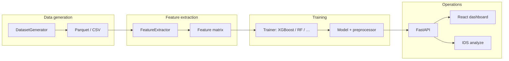
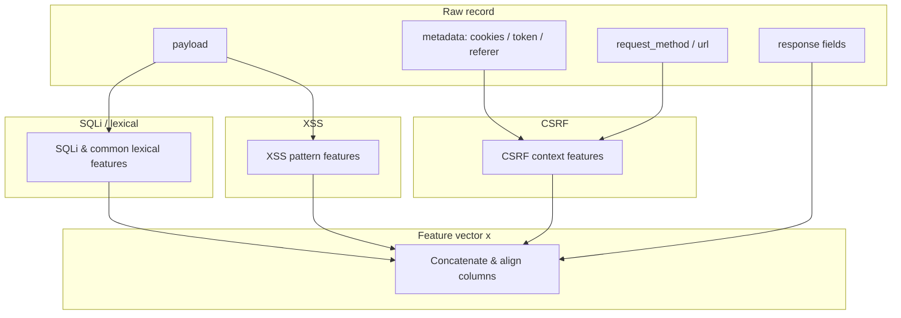
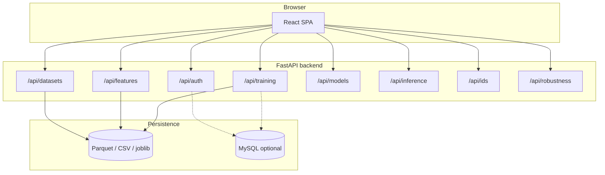
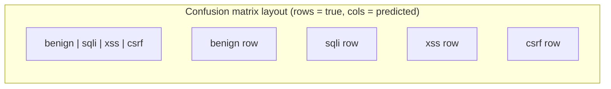
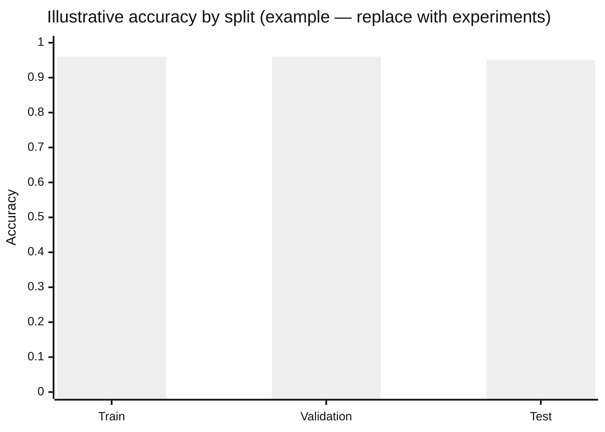

# WebGuard RF: A Machine Learning Framework for Multiclass Detection of SQL Injection, Cross-Site Scripting, and Cross-Site Request Forgery

**Authors:** [Your Name], [Affiliation]  
**Correspondence:** [email]  
**Date:** March 2025  

---

## Abstract

Web application attacks such as SQL injection (SQLi), cross-site scripting (XSS), and cross-site request forgery (CSRF) remain among the most prevalent threats in the OWASP taxonomy [1,2]. This paper presents **WebGuard RF**, an end-to-end research and engineering framework that combines scalable synthetic data generation, structured feature extraction, and gradient-boosted tree ensembles (with optional classical and linear baselines) to perform **multiclass** classification of benign traffic versus SQLi, XSS, and CSRF. The system integrates GPU-accelerated training (XGBoost with CUDA) [3], a REST API built on FastAPI [4], optional MySQL persistence with Alembic migrations, and a React-based dashboard for dataset management, training monitoring, model evaluation, robustness analysis, and a real-time intrusion detection system (IDS) prototype. We describe the pipeline architecture, feature design grounded in lexical and request-context signals—including **Shannon entropy** as a payload-complexity signal [5]—evaluation metrics with **macro-averaged** F1 [6], and practical lessons regarding **train–serve consistency** and **class calibration** under imbalance [7]. WebGuard RF is intended as both a reproducible research platform and a teaching vehicle for applied ML in cybersecurity.

**Keywords:** web application security, SQL injection, XSS, CSRF, machine learning, XGBoost, feature engineering, intrusion detection, multiclass classification

---

## 1. Introduction

Despite decades of mitigations—prepared statements, content security policies, and anti-CSRF tokens—injection and client-side attacks continue to exploit misconfigurations, legacy code, and insufficient input validation [1,8]. Signature-based web application firewalls (WAFs) scale poorly against polymorphic payloads and require constant rule maintenance [9]. Supervised learning offers a complementary path: models can generalize from statistical regularities in payloads and request metadata, provided that **labels**, **features**, and **deployment context** are aligned [10,11].

This work introduces **WebGuard RF** (WebGuard Random Forest–style ensemble framework), named for its heritage in tree-based ensembles [12] while supporting multiple modern boosters [3,13,14]. The project addresses four gaps common in academic prototypes: (1) **lack of unified pipelines** from raw or synthetic data to trained artifacts; (2) **weak multiclass treatment** (collapsing all attacks into one “malicious” label); (3) **missing operational tooling** (monitoring, comparison of models, exportable reports); and (4) **feature mismatch** between offline training records and online inference, which can inflate false positives or collapse predictions to a single class [7].

The main contributions of this paper, as reflected in the open-source implementation, are:

1. A **scalable dataset generator** (up to millions of samples) with simulated HTTP request/response fields and configurable attack/benign ratios.  
2. A **feature extraction module** supporting payload-only, response-aware (hybrid), and extended SQLi-centric feature sets combined with XSS, CSRF, and common lexical features.  
3. **Multi-algorithm training** (e.g., XGBoost, Random Forest, logistic regression, SVM, LightGBM, CatBoost) with GPU-oriented training for supported tree boosters and consistent metadata for downstream APIs.  
4. An **integrated web stack** for training, evaluation, robustness testing, and a **live IDS dashboard** with uncertainty-aware presentation (runner-up class, confidence margin \(\Delta = p_{(1)} - p_{(2)}\)).  
5. Explicit handling of **HTTP context defaults** at inference time to reduce systematic bias when headers are omitted in laboratory tests.

The remainder of this paper is organized as follows: Section 2 situates the work against related approaches. Section 3 formalizes the detection problem and threat assumptions. Section 4 details methodology—data, features, models, architecture, and **mathematical notation**. Section 5 discusses experimental and deployment considerations. Section 6 concludes and outlines future work.

---

## 2. Background and Related Work

**SQL injection** typically involves manipulating query syntax via quotes, logical operators, and database-specific constructs [8]. **XSS** injects executable content into contexts interpreted as HTML or script [1]. **CSRF** abuses a victim’s authenticated session to perform unintended state-changing actions, often exploiting missing or weak anti-CSRF tokens and cross-origin request patterns [1].

Classical defenses include static analysis, taint tracking, and runtime sanitization [15]. **Machine learning** approaches vary widely: some operate only on raw strings (e.g., character n-grams or embeddings), others on tokenized HTTP logs, and others on hybrid feature sets [9,10,16]. **Ensemble tree methods** (Random Forest, gradient boosting) remain attractive for tabular security features due to interpretability (e.g., mean decrease in impurity or coefficient magnitude) [12,17], strong default performance, and mature GPU implementations [3,13,14].

Prior work often reports **binary** “attack vs. benign” accuracy, which can obscure failure modes on specific attack families [11]. **Multiclass** evaluation (benign, SQLi, XSS, CSRF) better matches operational triage and incident labeling. WebGuard RF adopts multiclass training as a first-class mode while retaining binary classification for simplified baselines, consistent with recommendations to report **per-class** and **macro** metrics under imbalance [6,7].

**Related limitations** in literature include: (i) datasets that are not reproducible or not publicly aligned with feature code; (ii) evaluation only on static corpora without synthetic control of class balance; (iii) deployment studies that ignore request metadata (cookies, tokens, referer) used during training [10]. WebGuard RF partially mitigates (i)–(iii) through bundled generation, extraction, and explicit inference-time context profiles.

---

## 3. Problem Formulation and Threat Model

Let a **record** represent a web request (and optionally response attributes) summarized by a feature vector \(\mathbf{x} \in \mathbb{R}^d\) and a label \(y \in \mathcal{Y}\). In multiclass mode, \(\mathcal{Y} = \{\text{benign}, \text{sqli}, \text{xss}, \text{csrf}\}\); in binary mode, \(y \in \{0,1\}\) (benign vs. attack).

### 3.1 Learning objective

We seek a classifier \(f: \mathbb{R}^d \to \mathcal{Y}\) or a calibrated scorer that induces posterior estimates \(\hat{P}(y \mid \mathbf{x})\). Under the **empirical risk minimization** framework, with one-hot encoding \(\mathbf{e}_y\) and predicted class probabilities \(\hat{\mathbf{p}}(\mathbf{x}) = (\hat{p}_1,\ldots,\hat{p}_K)^\top\), the **multiclass cross-entropy** (negative log-likelihood) over \(N\) training samples is

$$
\mathcal{L}_{\mathrm{CE}} = -\frac{1}{N} \sum_{i=1}^{N} \sum_{k=1}^{K} e_{y_i,k}\,\log \hat{p}_k(\mathbf{x}_i) \;=\; -\frac{1}{N} \sum_{i=1}^{N} \log \hat{p}_{y_i}(\mathbf{x}_i).
\tag{1}
$$

For **softmax** parametrization with logits \(\mathbf{z}(\mathbf{x}) \in \mathbb{R}^K\),

$$
\hat{p}_k(\mathbf{x}) = \frac{\exp(z_k(\mathbf{x}))}{\sum_{j=1}^{K} \exp(z_j(\mathbf{x}))}.
\tag{2}
$$

Tree ensembles (XGBoost, LightGBM, CatBoost) and linear models optimize objectives related to (1) or margin-based surrogates (e.g., SVM) [3,12,18].

### 3.2 Evaluation metrics

For class \(k\), let **precision** \(P_k\), **recall** \(R_k\), and **F1** be computed from the confusion matrix [6]. The **macro-averaged F1** treats classes equally:

$$
\mathrm{F1}_{\mathrm{macro}} = \frac{1}{K} \sum_{k=1}^{K} \mathrm{F1}_k.
\tag{3}
$$

The **weighted F1** weights by support \(n_k\):

$$
\mathrm{F1}_{\mathrm{weighted}} = \sum_{k=1}^{K} \frac{n_k}{N}\, \mathrm{F1}_k.
\tag{4}
$$

**Accuracy** is \(\frac{1}{N}\sum_i \mathbb{1}[\hat{y}_i = y_i]\); under imbalance, accuracy can mask poor minority-class performance [7], so WebGuard RF surfaces (3)–(4) and full **confusion matrices** in the evaluation UI.

For **multiclass ROC-AUC**, we adopt the one-vs-rest (OvR) macro average as implemented in common toolchains [19].

### 3.3 Uncertainty heuristic (IDS)

Let ordered class probabilities be \(p_{(1)} \ge p_{(2)} \ge \cdots\). We flag **uncertain** predictions when

$$
p_{(1)} < \tau_c \quad \lor \quad \Delta < \tau_\Delta, \quad \Delta = p_{(1)} - p_{(2)},
\tag{5}
$$

with thresholds \(\tau_c,\tau_\Delta\) chosen for analyst workflow (defaults in implementation are illustrative).

**Threat model (evaluation scope).** We assume an adversary can craft payloads observable in the request body, query string, or headers available to the detector. The detector does not replace secure coding; it assists monitoring and prioritization. We **do not** claim robustness against adaptive adversaries who optimize specifically against the known feature set.

**Assumption:** Features available at training time are a superset of those computable at inference time. Misalignment between training-time HTTP simulation and inference-time defaults can dominate the decision boundary; the implementation supports **request context profiles** for reproducible experiments.

---

## 4. Methodology: The WebGuard RF Pipeline

**Figure 1** summarizes the end-to-end data flow from generation through deployment.

**Figure 1.** End-to-end pipeline: synthetic or uploaded raw data → feature files → training artifacts → API and IDS.

### 4.1 Data generation and schema

The **dataset generator** produces tabular datasets (e.g., Parquet) at scale. Each sample includes a **payload** string, a **label**, and **simulated HTTP metadata**: method, URL, cookies/token/referer flags, and response-oriented fields (status, length, timing, flags). Labels follow user-defined **attack ratio** \(\rho_{\mathrm{atk}}\) and sub-ratios among SQLi, XSS, and CSRF. Optional **label noise** at rate \(\eta\) flips labels to study robustness. The expected count of class \(k\) in a balanced-subattack design scales linearly with total sample size \(N\):

$$
\mathbb{E}[n_k] \approx N \cdot \rho_k, \quad \sum_k \rho_k = 1.
\tag{6}
$$

### 4.2 Feature engineering and entropy

Payload-derived features include keyword flags, structural counts, length, and **Shannon entropy** over character frequencies in the payload string \(s = c_1 c_2 \cdots c_L\). With character probabilities \(p(c)\) estimated from the observed payload,

$$
H(s) = -\sum_{c} p(c)\,\log_2 p(c).
\tag{7}
$$

Equation (7) summarizes distributional complexity and is correlated with encoding and obfuscation in attack strings [5]. Additional groups cover XSS tokens, CSRF metadata proxies, and request-shape statistics (Section 2 of the implementation README).

**Figure 2** sketches logical feature-group dependencies.

**Figure 2.** Logical grouping of feature sources into a fixed tabular vector \(\mathbf{x}\).

### 4.3 Learning algorithms

Training supports **XGBoost** [3] with GPU acceleration where available, **LightGBM** [13], **CatBoost** [14], **Random Forest** [12], **logistic regression**, and **SVM** [18]. **Gradient boosting** iteratively adds weak learners \(h_t\) to minimize a regularized objective of the schematic form [20]

$$
\mathcal{O} \approx \sum_i \ell(y_i, \hat{y}_i^{(t)}) + \sum_t \Omega(h_t),
\tag{8}
$$

where \(\ell\) is a differentiable loss (e.g., tied to cross-entropy for multiclass) and \(\Omega\) penalizes tree complexity. Exact formulations differ by library and hyperparameters [3,13,14].

### 4.4 System architecture

**Figure 3** depicts major API surfaces and the frontend.

**Figure 3.** Major REST modules and storage layers.

### 4.5 Multiclass confusion structure (conceptual)

For \(K=4\) classes, the **confusion matrix** \(\mathbf{C} \in \mathbb{N}^{K \times K}\) has entries \(C_{ij}\) = count of samples with true class \(i\) predicted as \(j\). **Figure 4** illustrates the layout; cell shading in publications should reflect normalized rows or columns for readability.

**Figure 4.** Conceptual \(4 \times 4\) confusion layout for multiclass web attack detection.

**Table 1** gives a template for reporting \(\mathbf{C}\); replace \(n_{ij}\) with counts from WebGuard RF **Model Evaluation** exports.

| True \\ Pred | benign | sqli | xss | csrf |
|:---:|:---:|:---:|:---:|:---:|
| **benign** | \(n_{11}\) | \(n_{12}\) | \(n_{13}\) | \(n_{14}\) |
| **sqli** | \(n_{21}\) | \(n_{22}\) | \(n_{23}\) | \(n_{24}\) |
| **xss** | \(n_{31}\) | \(n_{32}\) | \(n_{33}\) | \(n_{34}\) |
| **csrf** | \(n_{41}\) | \(n_{42}\) | \(n_{43}\) | \(n_{44}\) |

Row-normalized rates \(\tilde{n}_{ij} = n_{ij} / \sum_k n_{ik}\) aid interpretation of per-class recall and confusion partners [6].

### 4.6 Illustrative metric chart (replace with your runs)

**Figure 5** shows an **illustrative** bar chart of accuracy by split (values are placeholders—substitute results from your **Training Monitor** / evaluation exports).

**Figure 5.** Example accuracy-by-split visualization; replace with measured metrics from WebGuard RF Model Evaluation.

### 4.7 Inference and IDS prototype

The IDS **analyze** endpoint maps HTTP fields to \(\mathbf{x}\), applies **request context profiles** (default vs. CSRF-attack simulation), returns \(\hat{y}\) and \(\hat{\mathbf{p}}\), and surfaces **runner-up** class and margin \(\Delta\) as in (5).

---

## 5. Discussion

**Class imbalance and collapse.** When \(\rho_{\mathrm{atk}}\) is high and benign diversity is low, models may **collapse** toward a dominant attack label [7]; \(\mathrm{F1}_{\mathrm{macro}}\) (3) and \(\mathbf{C}\) expose this better than accuracy alone.

**Train–serve alignment.** CSRF-related dimensions of \(\mathbf{x}\) depend on token/referer metadata; inconsistent defaults between training simulation and inference inflate **dataset shift** [10].

**Generalization.** Synthetic data supports scale and control but may underrepresent application-specific benign vocabulary; hybrid evaluation on anonymized logs is recommended [11].

**Ethics and misuse.** Attack payloads are for authorized research only [21].

---

## 6. Conclusion and Future Work

WebGuard RF consolidates **data generation**, **feature engineering** (including entropy-based signals (7)), **multiclass ML** with several algorithms and GPU acceleration, and **operational tooling** into one framework, with explicit metrics (1)–(4) and uncertainty indicators (5).

Future work: **probability calibration** [22], **transformer** encoders for \(s\) fused with \(\mathbf{x}\) [23], **drift-aware** monitoring, and richer benign/CSRF corpora.

---

## References

[1] OWASP Foundation. *OWASP Top Ten – 2021: The Ten Most Critical Web Application Security Risks.* https://owasp.org/www-project-top-ten/  

[2] MITRE Corporation. *CVE and CWE* (vulnerability and weakness taxonomy). https://cwe.mitre.org/  

[3] Chen, T., & Guestrin, C. (2016). XGBoost: A scalable tree boosting system. In *Proceedings of the 22nd ACM SIGKDD International Conference on Knowledge Discovery and Data Mining (KDD)*, 785–794.  

[4] Ramírez, S. (2019–). *FastAPI* documentation. https://fastapi.tiangolo.com/  

[5] Shannon, C. E. (1948). A mathematical theory of communication. *Bell System Technical Journal*, 27(3), 379–423.  

[6] Sokolova, M., & Lapalme, G. (2009). A systematic analysis of performance measures for classification tasks. *Information Processing & Management*, 45(4), 427–437.  

[7] He, H., & Garcia, E. A. (2009). Learning from imbalanced data. *IEEE Transactions on Knowledge and Data Engineering*, 21(9), 1263–1284.  

[8] Halfond, W. G., Viegas, J., & Orso, A. (2006). A classification of SQL-injection attacks and countermeasures. In *IEEE International Symposium on Secure Software Engineering*.  

[9] Correa, J., et al. (2018). Analysis of machine learning approaches for web application firewalls. *IEEE Latin American Conference on Computational Intelligence (LA-CCI)*. (Representative WAF+ML line—cite specific survey used in your thesis if different.)  

[10] Quionero-Candela, J., et al. (2009). Dataset shift in machine learning. *MIT Press*.  

[11] Pendlebury, F., et al. (2019). TESSERACT: eliminating experimental bias in malware classification across space and time. In *USENIX Security Symposium*. (Example of rigorous ML-in-security evaluation—swap for closer related work.)  

[12] Breiman, L. (2001). Random forests. *Machine Learning*, 45(1), 5–32.  

[13] Ke, G., et al. (2017). LightGBM: A highly efficient gradient boosting decision tree. In *Advances in Neural Information Processing Systems (NeurIPS)*, 30.  

[14] Prokhorenkova, L., et al. (2018). CatBoost: unbiased boosting with categorical features. In *Advances in Neural Information Processing Systems (NeurIPS)*, 31.  

[15] Livshits, B., et al. (2005). Improving software security with static analysis. *IEEE Security & Privacy*, 3(5), 53–58.  

[16] Torrano-Gimenez, C., et al. (2011). An anomaly-based approach for SQL injection detection. In *International Conference on Computational Intelligence in Security for Information Systems*.  

[17] Lundberg, S. M., & Lee, S.-I. (2017). A unified approach to interpreting model predictions. In *NeurIPS* (SHAP).  

[18] Cortes, C., & Vapnik, V. (1995). Support-vector networks. *Machine Learning*, 20(3), 273–297.  

[19] Hand, D. J., & Till, R. J. (2001). A simple generalisation of the area under the ROC curve for multiple class classification problems. *Machine Learning*, 45(2), 171–186.  

[20] Friedman, J. H. (2001). Greedy function approximation: a gradient boosting machine. *Annals of Statistics*, 29(5), 1189–1232.  

[21] Kenneally, E., & Bailey, M. (2010). Ethical principles for computer security research. *USENIX LEET*.  

[22] Guo, C., et al. (2017). On calibration of modern neural networks. In *ICML*.  

[23] Vaswani, A., et al. (2017). Attention is all you need. In *NeurIPS*.  

[24] Pedregosa, F., et al. (2011). Scikit-learn: Machine learning in Python. *Journal of Machine Learning Research*, 12, 2825–2830.  

[25] Team, T. P. D. (2024). *pandas* (Python data analysis library). https://pandas.pydata.org/  

---

## Appendix A: Reproducibility Note

Clone the **WebGuard RF** repository, install dependencies, configure `.env` from `.env.example`, run migrations if MySQL is enabled, and record GPU driver/CUDA versions. Export **Figure 5** and confusion matrices from your own training runs to replace placeholders.

---

## Appendix B: Rendering figures and formulas

- **Mermaid:** GitHub, GitLab, many Markdown previewers, and Pandoc with `--filter mermaid-filter` can render Figures 1–5.  
- **LaTeX math:** Use `$$ ... $$` for display equations; Word users can paste via Pandoc or use Equation editor.  
- **PDF:** `pandoc docs/Research_Article_WebGuard_RF.md -o article.pdf --pdf-engine=xelatex` (may require LaTeX; Mermaid may need pre-rendering to PNG).

---

*Suggested citation:*  
*[Author]. (2025). WebGuard RF: A Machine Learning Framework for Multiclass Detection of SQL Injection, XSS, and CSRF. Technical report / seminar paper, WebGuard RF open-source project.*
